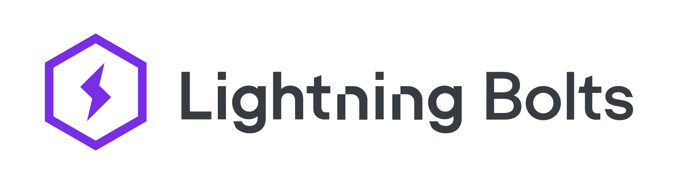

<div align="center">



**Deep Learning components for extending PyTorch Lightning**

______________________________________________________________________

<p align="center">
  <a href="#install">Installation</a> •
  <a href="https://lightning-bolts.readthedocs.io/en/latest/">Latest Docs</a> •
  <a href="https://lightning-bolts.readthedocs.io/en/stable/">Stable Docs</a> •
  <a href="#what-is-bolts">About</a> •
  <a href="#team">Community</a> •
  <a href="https://www.pytorchlightning.ai/">Website</a> •
  <a href="https://www.grid.ai/">Grid AI</a> •
  <a href="#license">License</a>
</p>

[](https://badge.fury.io/py/lightning-bolts)
[](https://pepy.tech/project/lightning-bolts)
[](https://dev.azure.com/PytorchLightning/lightning%20Bolts/_build/latest?definitionId=5&branchName=master)
[](https://codecov.io/gh/PyTorchLightning/lightning-bolts)
[](https://www.codefactor.io/repository/github/pytorchlightning/lightning-bolts)

[](https://lightning-bolts.readthedocs.io/en/latest/)
[](https://join.slack.com/t/pytorch-lightning/shared_invite/zt-pw5v393p-qRaDgEk24~EjiZNBpSQFgQ)
[](https://github.com/PytorchLightning/lightning-bolts/blob/master/LICENSE)

</div>

______________________________________________________________________

## Getting Started

Pip / Conda

```bash
pip install lightning-bolts
```

<details>
  <summary>Other installations</summary>

Install bleeding-edge (no guarantees)

```bash
pip install git+https://github.com/PytorchLightning/lightning-bolts.git@master --upgrade
```

To install all optional dependencies

```bash
pip install lightning-bolts["extra"]
```

</details>

## What is Bolts

Bolts provides a variety of components to extend PyTorch Lightning such as callbacks & datasets, for applied research and production.

## News

- Sept 22: [Leverage Sparsity for Faster Inference with Lightning Flash and SparseML](https://devblog.pytorchlightning.ai/leverage-sparsity-for-faster-inference-with-lightning-flash-and-sparseml-cdda1165622b)
- Aug 26: [Fine-tune Transformers Faster with Lightning Flash and Torch ORT](https://devblog.pytorchlightning.ai/fine-tune-transformers-faster-with-lightning-flash-and-torch-ort-ec2d53789dc3)

#### Example 1: Accelerate Lightning Training with the Torch ORT Callback

Torch ORT converts your model into an optimized ONNX graph, speeding up training & inference when using NVIDIA or AMD GPUs. See the [documentation](https://lightning-bolts.readthedocs.io/en/latest/callbacks/torch_ort.html) for more details.

```python
from pytorch_lightning import LightningModule, Trainer
import torchvision.models as models
from pl_bolts.callbacks import ORTCallback


class VisionModel(LightningModule):
    def __init__(self):
        super().__init__()
        self.model = models.vgg19_bn(pretrained=True)

    ...


model = VisionModel()
trainer = Trainer(gpus=1, callbacks=ORTCallback())
trainer.fit(model)
```

#### Example 2: Introduce Sparsity with the SparseMLCallback to Accelerate Inference

We can introduce sparsity during fine-tuning with [SparseML](https://github.com/neuralmagic/sparseml), which ultimately allows us to leverage the [DeepSparse](https://github.com/neuralmagic/deepsparse) engine to see performance improvements at inference time.

```python
from pytorch_lightning import LightningModule, Trainer
import torchvision.models as models
from pl_bolts.callbacks import SparseMLCallback


class VisionModel(LightningModule):
    def __init__(self):
        super().__init__()
        self.model = models.vgg19_bn(pretrained=True)

    ...


model = VisionModel()
trainer = Trainer(gpus=1, callbacks=SparseMLCallback(recipe_path="recipe.yaml"))
trainer.fit(model)
```

## Are specific research implementations supported?

We've deprecated a bunch of specific model research, primarily because they've grown outdated or support for them was not possible. This also means in the future we'll not accept any model specific research. We'd like to encourage users to contribute general components that will help a broad range of problems, however components that help specifics domains will also be welcomed!

For example a callback to help train SSL models would be a great contribution, however the next greatest SSL model from your latest paper would be a good contribution to [Lightning Flash](https://github.com/PyTorchLightning/lightning-flash).

Use [Lightning Flash](https://github.com/PyTorchLightning/lightning-flash) to train, predict and serve state-of-the-art models for applied research. We suggest looking at our [VISSL](https://lightning-flash.readthedocs.io/en/latest/integrations/vissl.html) Flash integration for SSL based tasks.

See [Deprecated Modules](https://lightning-bolts.readthedocs.io/en/latest/deprecated.html) for more information.

## Contribute!

Bolts is supported by the PyTorch Lightning team and the PyTorch Lightning community!

Join our Slack and/or read our [CONTRIBUTING](./.github/CONTRIBUTING.md) guidelines to get help becoming a contributor!

______________________________________________________________________

## Citation

To cite bolts use:

```
@article{falcon2020framework,
  title={A Framework For Contrastive Self-Supervised Learning And Designing A New Approach},
  author={Falcon, William and Cho, Kyunghyun},
  journal={arXiv preprint arXiv:2009.00104},
  year={2020}
}
```

To cite other contributed models or modules, please cite the authors directly (if they don't have bibtex, ping the authors on a GH issue)

## License

Please observe the Apache 2.0 license that is listed in this repository.
In addition the Lightning framework is Patent Pending.
