Reinforcement Learning
======================

This module is a collection of common RL approaches implemented in Lightning.

.. note::

    We rely on the community to keep these updated and working. If something doesn't work, we'd really appreciate a contribution to fix!

-----------------

Module authors
--------------

Contributions by: `Donal Byrne <https://github.com/djbyrne>`_

- DQN
- Double DQN
- Dueling DQN
- Noisy DQN
- NStep DQN
- Prioritized Experience Replay DQN
- Reinforce
- Vanilla Policy Gradient

------------

.. note::
    RL models currently only support CPU and single GPU training with `accelerator=dp`.
    Full GPU support will be added in later updates.

------------

DQN Models
----------

The following models are based on DQN. DQN uses value based learning where it is deciding what action to take based
on the model's current learned value (V), or the state action value (Q) of the current state. These values are defined
as the discounted total reward of the agents state or state action pair.

---------------

Deep-Q-Network (DQN)
^^^^^^^^^^^^^^^^^^^^

DQN model introduced in `Playing Atari with Deep Reinforcement Learning <https://www.cs.toronto.edu/~vmnih/docs/dqn.pdf>`_.
Paper authors: Volodymyr Mnih, Koray Kavukcuoglu, David Silver, Alex Graves, Ioannis Antonoglou, Daan Wierstra, Martin Riedmiller.

Original implementation by: `Donal Byrne <https://github.com/djbyrne>`_

The DQN was introduced in `Playing Atari with Deep Reinforcement Learning <https://www.cs.toronto.edu/~vmnih/docs/dqn.pdf>`_ by
researchers at DeepMind. This took the concept of tabular Q learning and scaled it to much larger problems by
approximating the Q function using a deep neural network.

The goal behind DQN was to take the simple control method of Q learning and scale it up in order to solve complicated \
tasks. As well as this, the method needed to be stable. The DQN solves these issues with the following additions.

**Approximated Q Function**

Storing Q values in a table works well in theory, but is completely unscalable. Instead, the authors approximate the
Q function using a deep neural network. This allows the DQN to be used for much more complicated tasks

**Replay Buffer**

Similar to supervised learning, the DQN learns on randomly sampled batches of previous data stored in an
Experience Replay Buffer. The 'target' is calculated using the Bellman equation

.. math::

    Q(s,a)<-(r+{\gamma}\max_{a'{\in}A}Q(s',a'))^2

and then we optimize using SGD just like a standard supervised learning problem.

.. math::

    L=(Q(s,a)-(r+{\gamma}\max_{a'{\in}A}Q(s',a'))^2

DQN Results
~~~~~~~~~~~

**DQN: Pong**

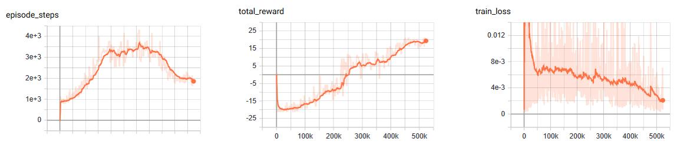

Example::

    from pl_bolts.models.rl import DQN
    dqn = DQN("PongNoFrameskip-v4")
    trainer = Trainer()
    trainer.fit(dqn)

.. autoclass:: pl_bolts.models.rl.DQN
   :noindex:

---------------

Double DQN
^^^^^^^^^^

Double DQN model introduced in `Deep Reinforcement Learning with Double Q-learning <https://arxiv.org/pdf/1509.06461.pdf>`_
Paper authors: Hado van Hasselt, Arthur Guez, David Silver

Original implementation by: `Donal Byrne <https://github.com/djbyrne>`_

The original DQN tends to overestimate Q values during the Bellman update, leading to instability and is harmful to
training. This is due to the max operation in the Bellman equation.

We are constantly taking the max of our agents estimates
during our update. This may seem reasonable, if we could trust these estimates. However during the early stages of
training, the estimates for these values will be off center and can lead to instability in training until
our estimates become more reliable

The Double DQN fixes this overestimation by choosing actions for the next state using the main trained network
but uses the values of these actions from the more stable target network. So we are still going to take the greedy
action, but the value will be less "optimisitc" because it is chosen by the target network.

**DQN expected return**

.. math::

    Q(s_t, a_t) = r_t + \gamma * \max_{Q'}(S_{t+1}, a)

**Double DQN expected return**

.. math::

    Q(s_t, a_t) = r_t + \gamma * \max{Q'}(S_{t+1}, \arg\max_Q(S_{t+1}, a))

Double DQN Results
~~~~~~~~~~~~~~~~~~

**Double DQN: Pong**

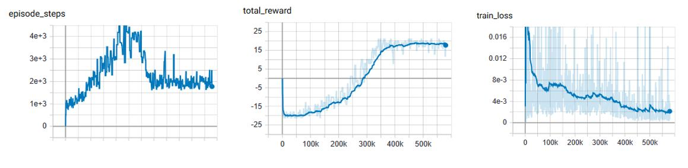

**DQN vs Double DQN: Pong**

orange: DQN

blue: Double DQN

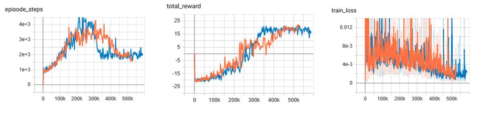

Example::

    from pl_bolts.models.rl import DoubleDQN
    ddqn = DoubleDQN("PongNoFrameskip-v4")
    trainer = Trainer()
    trainer.fit(ddqn)

.. autoclass:: pl_bolts.models.rl.DoubleDQN
   :noindex:

---------------

Dueling DQN
^^^^^^^^^^^

Dueling DQN model introduced in `Dueling Network Architectures for Deep Reinforcement Learning <https://arxiv.org/abs/1511.06581>`_
Paper authors: Ziyu Wang, Tom Schaul, Matteo Hessel, Hado van Hasselt, Marc Lanctot, Nando de Freitas

Original implementation by: `Donal Byrne <https://github.com/djbyrne>`_

The Q value that we are trying to approximate can be divided into two parts, the value state V(s) and the 'advantage'
of actions in that state A(s, a). Instead of having one full network estimate the entire Q value, Dueling DQN uses two
estimator heads in order to separate the estimation of the two parts.

The value is the same as in value iteration. It is the discounted expected reward achieved from state s. Think of the
value as the 'base reward' from being in state s.

The advantage tells us how much 'extra' reward we get from taking action a while in state s. The advantage bridges the
gap between Q(s, a) and V(s) as Q(s, a) = V(s) + A(s, a).

In the paper `Dueling Network Architectures for Deep Reinforcement Learning <https://arxiv.org/abs/1511.06581>` the
network uses two heads, one outputs the value state and the other outputs the advantage. This leads to better
training stability, faster convergence and overall better results. The V head outputs a single scalar
(the state value), while the advantage head outputs a tensor equal to the size of the action space, containing
an advantage value for each action in state s.

Changing the network architecture is not enough, we also need to ensure that the advantage mean is 0. This is done
by subtracting the mean advantage from the Q value. This essentially pulls the mean advantage to 0.

.. math::

    Q(s, a) = V(s) + A(s, a) - 1/N * \sum_k(A(s, k)

Dueling DQN Benefits
~~~~~~~~~~~~~~~~~~~~

- Ability to efficiently learn the state value function. In the dueling network, every Q update also updates the value
  stream, where as in DQN only the value of the chosen action is updated. This provides a better approximation of the
  values
- The differences between total Q values for a given state are quite small in relation to the magnitude of Q. The
  difference in the Q values between the best action and the second best action can be very small, while the average
  state value can be much larger. The differences in scale can introduce noise, which may lead to the greedy policy
  switching the priority of these actions. The seperate estimators for state value and advantage makes the Dueling
  DQN robust to this type of scenario

Dueling DQN Results
~~~~~~~~~~~~~~~~~~~

The results below a noticeable improvement from the original DQN network.

**Dueling DQN baseline: Pong**

Similar to the results of the DQN baseline, the agent has a period where the number of steps per episodes increase as
it begins to hold its own against the heuristic oppoent, but then the steps per episode quickly begins to drop
as it gets better and starts to beat its opponent faster and faster. There is a noticable point at step ~250k
where the agent goes from losing to winning.

As you can see by the total rewards, the dueling network's training progression is very stable and continues to trend
upward until it finally plateus.

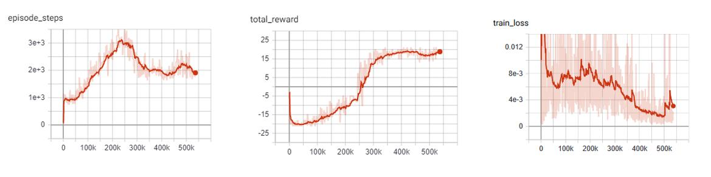

**DQN vs Dueling DQN: Pong**

In comparison to the base DQN, we see that the Dueling network's training is much more stable and is able to reach a
score in the high teens faster than the DQN agent. Even though the Dueling network is more stable and out performs DQN
early in training, by the end of training the two networks end up at the same point.

This could very well be due to the simplicity of the Pong environment.

 - Orange: DQN
 - Red: Dueling DQN

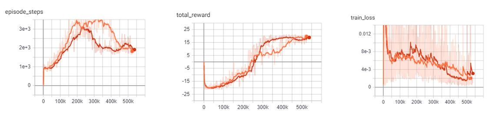

Example::

    from pl_bolts.models.rl import DuelingDQN
    dueling_dqn = DuelingDQN("PongNoFrameskip-v4")
    trainer = Trainer()
    trainer.fit(dueling_dqn)

.. autoclass:: pl_bolts.models.rl.DuelingDQN
   :noindex:

--------------

Noisy DQN
^^^^^^^^^

Noisy DQN model introduced in `Noisy Networks for Exploration <https://arxiv.org/abs/1706.10295>`_
Paper authors: Meire Fortunato, Mohammad Gheshlaghi Azar, Bilal Piot, Jacob Menick, Ian Osband, Alex Graves,
Vlad Mnih, Remi Munos, Demis Hassabis, Olivier Pietquin, Charles Blundell, Shane Legg

Original implementation by: `Donal Byrne <https://github.com/djbyrne>`_

Up until now the DQN agent uses a seperate exploration policy, generally epsilon-greedy where start and end values
are set for its exploration. `Noisy Networks For Exploration <https://arxiv.org/abs/1706.10295>` introduces
a new exploration strategy by adding noise parameters to the weights of the fully connect layers which get updated
during backpropagation of the network. The noise parameters drive
the exploration of the network instead of simply taking random actions more frequently at the start of training and
less frequently towards the end. The of authors of
propose two ways of doing this.

During the optimization step a new set of noisy parameters are sampled. During training the agent acts according to
the fixed set of parameters. At the next optimization step, the parameters are updated with a new sample. This ensures
the agent always acts based on the parameters that are drawn from the current noise
distribution.

The authors propose two methods of injecting noise to the network.

1) Independent Gaussian Noise: This injects noise per weight. For each weight a random value is taken from
   the distribution. Noise parameters are stored inside the layer and are updated during backpropagation.
   The output of the layer is calculated as normal.
2) Factorized Gaussian Noise: This injects nosier per input/ouput. In order to minimize the number of random values
   this method stores two random vectors, one with the size of the input and the other with the size of the output.
   Using these two vectors, a random matrix is generated for the layer by calculating the outer products of the vector

Noisy DQN Benefits
~~~~~~~~~~~~~~~~~~

- Improved exploration function. Instead of just performing completely random actions, we add decreasing amount of noise
  and uncertainty to our policy allowing to explore while still utilising its policy.
- The fact that this method is automatically tuned means that we do not have to tune hyper parameters for
  epsilon-greedy!

.. note::
    For now I have just implemented the Independant Gaussian as it has been reported there isn't much difference
    in results for these benchmark environments.

In order to update the basic DQN to a Noisy DQN we need to do the following

Noisy DQN Results
~~~~~~~~~~~~~~~~~

The results below improved stability and faster performance growth.

**Noisy DQN baseline: Pong**

Similar to the other improvements, the average score of the agent reaches positive numbers around the 250k mark and
steadily increases till convergence.

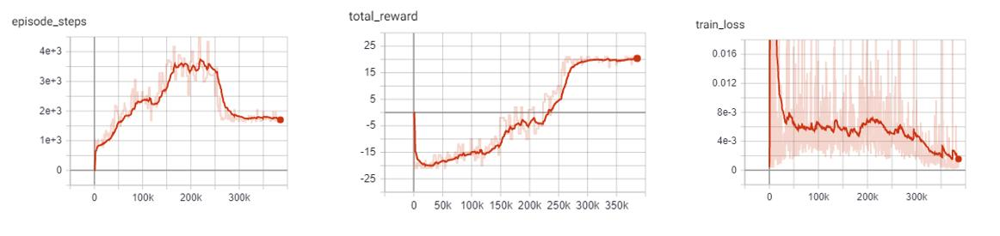

**DQN vs Noisy DQN: Pong**

In comparison to the base DQN, the Noisy DQN is more stable and is able to converge on an optimal policy much faster
than the original. It seems that the replacement of the epsilon-greedy strategy with network noise provides a better
form of exploration.

- Orange: DQN
- Red: Noisy DQN

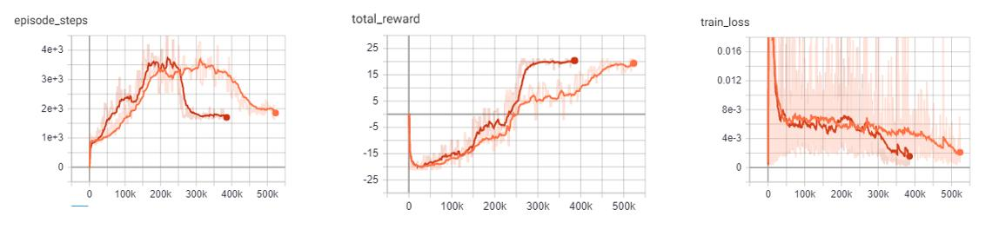

Example::

    from pl_bolts.models.rl import NoisyDQN
    noisy_dqn = NoisyDQN("PongNoFrameskip-v4")
    trainer = Trainer()
    trainer.fit(noisy_dqn)

.. autoclass:: pl_bolts.models.rl.NoisyDQN
   :noindex:

--------------

N-Step DQN
^^^^^^^^^^

N-Step DQN model introduced in `Learning to Predict by the Methods of Temporal Differences  <http://incompleteideas.net/papers/sutton-88-with-erratum.pdf>`_
Paper authors: Richard S. Sutton

Original implementation by: `Donal Byrne <https://github.com/djbyrne>`_

N Step DQN was introduced in `Learning to Predict by the Methods of Temporal Differences
<http://incompleteideas.net/papers/sutton-88-with-erratum.pdf>`_.
This method improves upon the original DQN by updating our Q values with the expected reward from multiple steps in the
future as opposed to the expected reward from the immediate next state. When getting the Q values for a state action
pair using a single step which looks like this

.. math::

    Q(s_t,a_t)=r_t+{\gamma}\max_aQ(s_{t+1},a_{t+1})

but because the Q function is recursive we can continue to roll this out into multiple steps, looking at the expected
return for each step into the future.

.. math::

    Q(s_t,a_t)=r_t+{\gamma}r_{t+1}+{\gamma}^2\max_{a'}Q(s_{t+2},a')

The above example shows a 2-Step look ahead, but this could be rolled out to the end of the episode, which is just
Monte Carlo learning. Although we could just do a monte carlo update and look forward to the end of the episode, it
wouldn't be a good idea. Every time we take another step into the future, we are basing our approximation off our
current policy. For a large portion of training, our policy is going to be less than optimal. For example, at the start
of training, our policy will be in a state of high exploration, and will be little better than random.

.. note::
    For each rollout step you must scale the discount factor accordingly by the number of steps. As you can see from the
    equation above, the second gamma value is to the power of 2. If we rolled this out one step further, we would use
    gamma to the power of 3 and so.

So if we are aproximating future rewards off a bad policy, chances are those approximations are going to be pretty
bad and every time we unroll our update equation, the worse it will get. The fact that we are using an off policy
method like DQN with a large replay buffer will make this even worse, as there is a high chance that we will be
training on experiences using an old policy that was worse than our current policy.

So we need to strike a balance between looking far enough ahead to improve the convergence of our agent, but not so far
that are updates become unstable. In general, small values of 2-4 work best.

N-Step Benefits
~~~~~~~~~~~~~~~

- Multi-Step learning is capable of learning faster than typical 1 step learning methods.
- Note that this method introduces a new hyperparameter n. Although n=4 is generally a good starting point and provides
  good results across the board.

N-Step Results
~~~~~~~~~~~~~~

As expected, the N-Step DQN converges much faster than the standard DQN, however it also adds more instability to the
loss of the agent. This can be seen in the following experiments.

**N-Step DQN: Pong**

The N-Step DQN shows the greatest increase in performance with respect to the other DQN variations.
After less than 150k steps the agent begins to consistently win games and achieves the top score after ~170K steps.
This is reflected in the sharp peak of the total episode steps and of course, the total episode rewards.

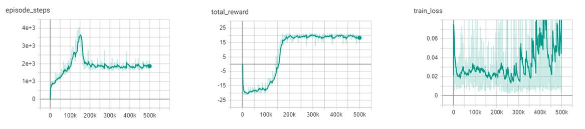

**DQN vs N-Step DQN: Pong**

This improvement is shown in stark contrast to the base DQN, which only begins to win games after 250k steps and
requires over twice as many steps (450k) as the N-Step agent to achieve the high score of 21. One important thing to
notice is the large increase in the loss of the N-Step agent. This is expected as the agent is building
its expected reward off approximations of the future states. The large the size of N, the greater the instability.
Previous literature, listed below, shows the best results for the Pong environment with an N step between 3-5.
For these experiments I opted with an N step of 4.

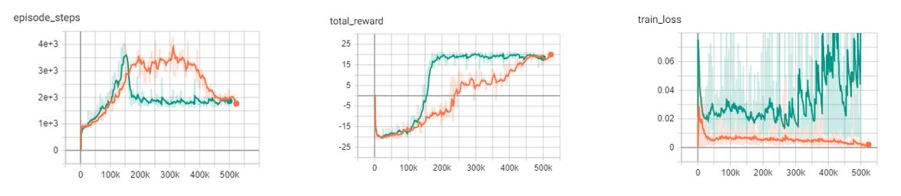

Example::

    from pl_bolts.models.rl import DQN
    n_step_dqn = DQN("PongNoFrameskip-v4", n_steps=4)
    trainer = Trainer()
    trainer.fit(n_step_dqn)

--------------

Prioritized Experience Replay DQN
^^^^^^^^^^^^^^^^^^^^^^^^^^^^^^^^^

Double DQN model introduced in `Prioritized Experience Replay  <http://incompleteideas.net/papers/sutton-88-with-erratum.pdf>`_
Paper authors: Tom Schaul, John Quan, Ioannis Antonoglou, David Silver

Original implementation by: `Donal Byrne <https://github.com/djbyrne>`_

The standard DQN uses a buffer to break up the correlation between experiences and uniform random samples for each
batch. Instead of just randomly sampling from the buffer prioritized experience replay (PER) prioritizes these samples
based on training loss. This concept was introduced in the paper
`Prioritized Experience Replay <https://arxiv.org/abs/1511.05952>`__

Essentially we want to train more on the samples that surprise the agent.

The priority of each sample is defined below where

.. math::

    P(i) = P^\alpha_i / \sum_k P_k^\alpha

where pi is the priority of the ith sample in the buffer and
𝛼 is the number that shows how much emphasis we give to the priority. If 𝛼 = 0 , our
sampling will become uniform as in the classic DQN method. Larger values for 𝛼 put
more stress on samples with higher priority

Its important that new samples are set to the highest priority so that they are sampled soon. This however introduces
bias to new samples in our dataset. In order to compensate for this bias, the value of the weight is defined as

.. math::

    w_i=(N . P(i))^{-\beta}

Where beta is a hyper parameter between 0-1. When beta is 1 the bias is fully compensated. However authors noted that
in practice it is better to start beta with a small value near 0 and slowly increase it to 1.

PER Benefits
~~~~~~~~~~~~

- The benefits of this technique are that the agent sees more samples that it struggled with and gets more
  chances to improve upon it.

**Memory Buffer**

First step is to replace the standard experience replay buffer with the prioritized experience replay buffer. This
is pretty large (100+ lines) so I wont go through it here. There are two buffers implemented. The first is a naive
list based buffer found in memory.PERBuffer and the second is more efficient buffer using a Sum Tree datastructure.

The list based version is simpler, but has a sample complexity of O(N). The Sum Tree in comparison has a complexity
of O(1) for sampling and O(logN) for updating priorities.

**Update loss function**

The next thing we do is to use the sample weights that we get from PER. Add the following code to the end of the
loss function. This applies the weights of our sample to the batch loss. Then we return the mean loss and weighted loss
for each datum, with the addition of a small epsilon value.

PER Results
~~~~~~~~~~~

The results below show improved stability and faster performance growth.

**PER DQN: Pong**

Similar to the other improvements, we see that PER improves the stability of the agents training and shows to converged
on an optimal policy faster.

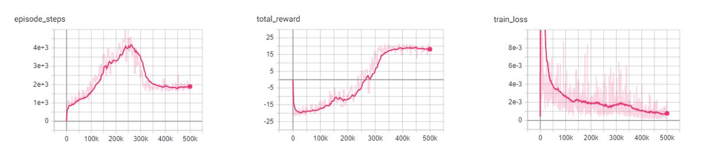

**DQN vs PER DQN: Pong**

In comparison to the base DQN, the PER DQN does show improved stability and performance. As expected, the loss
of the PER DQN is siginificantly lower. This is the main objective of PER by focusing on experiences with high loss.

It is important to note that loss is not the only metric we should be looking at. Although the agent may have very
low loss during training, it may still perform poorly due to lack of exploration.

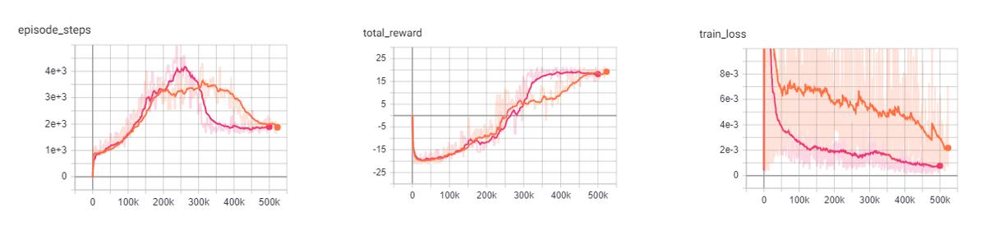

- Orange: DQN
- Pink: PER DQN

Example::

    from pl_bolts.models.rl import PERDQN
    per_dqn = PERDQN("PongNoFrameskip-v4")
    trainer = Trainer()
    trainer.fit(per_dqn)

.. autoclass:: pl_bolts.models.rl.PERDQN
   :noindex:

--------------

Policy Gradient Models
----------------------
The following models are based on Policy Gradients. Unlike the Q learning models shown before, Policy based models
do not try and learn the specifc values of state or state action pairs. Instead it cuts out the middle man and
directly learns the policy distribution. In Policy Gradient models we update our network parameters in the direction
suggested by our policy gradient in order to find a policy that produces the highest results.

Policy Gradient Key Points:
    - Outputs a distribution of actions instead of discrete Q values
    - Optimizes the policy directly, instead of indirectly through the optimization of Q values
    - The policy distribution of actions allows the model to handle more complex action spaces, such as continuous actions
    - The policy distribution introduces stochasticity, providing natural exploration to the model
    - The policy distribution provides a more stable update as a change in weights will only change the total distribution
      slightly, as opposed to changing weights based on the Q value of state S will change all Q values with similar states.
    - Policy gradients tend to converge faste, however they are not as sample efficient and generally require more
      interactions with the environment.

--------------

REINFORCE
^^^^^^^^^

REINFORCE model introduced in `Policy Gradient Methods For Reinforcement Learning With Function Approximation <https://papers.nips.cc/paper/1713-policy-gradient-methods-for-reinforcement-learning-with-function-approximation.pdf>`_
Paper authors: Richard S. Sutton, David McAllester, Satinder Singh, Yishay Mansour

Original implementation by: `Donal Byrne <https://github.com/djbyrne>`_

REINFORCE is one of the simplest forms of the Policy Gradient method of RL. This method uses a Monte Carlo rollout,
where its steps through entire episodes of the environment to build up trajectories computing the total rewards. The
algorithm is as follows:

1. Initialize our network.
2. Play N full episodes saving the transitions through the environment.
3. For every step `t` in each episode `k` we calculate the discounted reward of the subsequent steps.

.. math::

    Q_{k,t} = \sum_{i=0}\gamma^i r_i

4. Calculate the loss for all transitions.

.. math::

    L =  - \sum_{k,t} Q_{k,t} \log(\pi(S_{k,t}, A_{k,t}))

5. Perform SGD on the loss and repeat.

What this loss function is saying is simply that we want to take the log probability of action A at state S given
our policy (network output). This is then scaled by the discounted reward that we calculated in the previous step.
We then take the negative of our sum. This is because the loss is minimized during SGD, but we want to
maximize our policy.

.. note::
    The current implementation does not actually wait for the batch episodes the complete every time as we pass in a
    fixed batch size. For the time being we simply use a large batch size to accomodate this. This approach still works
    well for simple tasks as it still manages to get an accurate Q value by using a large batch size, but it is not
    as accurate or completely correct. This will be updated in a later version.

REINFORCE Benefits
~~~~~~~~~~~~~~~~~~~~~~~~

- Simple and straightforward

- Computationally more efficient for simple tasks such as Cartpole than the Value Based methods.

REINFORCE Results
~~~~~~~~~~~~~~~~~~~~~

Hyperparameters:

- Batch Size: 800
- Learning Rate: 0.01
- Episodes Per Batch: 4
- Gamma: 0.99

TODO: Add results graph

Example::

    from pl_bolts.models.rl import Reinforce
    reinforce = Reinforce("CartPole-v0")
    trainer = Trainer()
    trainer.fit(reinforce)

.. autoclass:: pl_bolts.models.rl.Reinforce
   :noindex:

--------------

Vanilla Policy Gradient
^^^^^^^^^^^^^^^^^^^^^^^

Vanilla Policy Gradient model introduced in `Policy Gradient Methods For Reinforcement Learning With Function Approximation <https://papers.nips.cc/paper/1713-policy-gradient-methods-for-reinforcement-learning-with-function-approximation.pdf>`_
Paper authors: Richard S. Sutton, David McAllester, Satinder Singh, Yishay Mansour

Original implementation by: `Donal Byrne <https://github.com/djbyrne>`_

Vanilla Policy Gradient (VPG) expands upon the REINFORCE algorithm and improves some of its major issues. The major
issue with REINFORCE is that it has high variance. This can be improved by subtracting a baseline value from the
Q values. For  this implementation we use the average reward as our baseline.

Although Policy Gradients are able to explore naturally due to the stochastic nature of the model, the agent can still
frequently be stuck in a local optima. In order to improve this, VPG adds an entropy term to improve exploration.

.. math::

    H(\pi) = - \sum \pi (a | s) \log \pi (a | s)

To further control the amount of additional entropy in our model we scale the entropy term by a small beta value. The
scaled entropy is then subtracted from the policy loss.

VPG Benefits
~~~~~~~~~~~~~~~

- Addition of the baseline reduces variance in the model

- Improved exploration due to entropy bonus

VPG Results
~~~~~~~~~~~~~~~~

Hyperparameters:

- Batch Size: 8
- Learning Rate: 0.001
- N Steps: 10
- N environments: 4
- Entropy Beta: 0.01
- Gamma: 0.99

Example::

    from pl_bolts.models.rl import VanillaPolicyGradient
    vpg = VanillaPolicyGradient("CartPole-v0")
    trainer = Trainer()
    trainer.fit(vpg)

.. autoclass:: pl_bolts.models.rl.VanillaPolicyGradient
   :noindex:

--------------

Actor-Critic Models
-------------------
The following models are based on Actor Critic. Actor Critic conbines the approaches of value-based learning (the DQN family)
and the policy-based learning (the PG family) by learning the value function as well as the policy distribution. This approach
updates the policy network according to the policy gradient, and updates the value network to fit the discounted rewards.

Actor Critic Key Points:
    - Actor outputs a distribution of actions for controlling the agent
    - Critic outputs a value of current state for policy update suggestion
    - The addition of critic allows the model to do n-step training instead of generating an entire trajectory

Advantage Actor Critic (A2C)
^^^^^^^^^^^^^^^^^^^^^^^^^^^^

(Asynchronous) Advantage Actor Critic model introduced in `Asynchronous Methods for Deep Reinforcement Learning <https://arxiv.org/abs/1602.01783>`_
Paper authors: Volodymyr Mnih, Adrià Puigdomènech Badia, Mehdi Mirza, Alex Graves, Timothy P. Lillicrap, Tim Harley, David Silver, Koray Kavukcuoglu

Original implementation by: `Jason Wang <https://github.com/blahBlahhhJ>`_

Advantage Actor Critic (A2C) is the classical actor critic approach in reinforcement learning. The underlying neural
network has an actor head and a critic head to output action distribution as well as value of current state. Usually the
first few layers are shared by the two heads to prevent learning similar stuff twice. It builds upon the idea of using a
baseline of average reward to reduce variance (in VPG) by using the critic as a baseline which could theoretically have
better performance.

The algorithm can use an n-step training approach instead of generating an entire trajectory. The algorithm is as follows:

1. Initialize our network.
2. Rollout n steps and save the transitions (states, actions, rewards, values, dones).
3. Calculate the n-step (discounted) return by bootstrapping the last value.

.. math::

  G_{n+1} = V_{n+1}, G_t = r_t + \gamma G_{t+1} \ \forall t \in [0,n]

4. Calculate actor loss using values as baseline.

.. math::

  L_{actor} = - \frac1n \sum_t (G_t - V_t) \log \pi (a_t | s_t)

5. Calculate critic loss using returns as target.

.. math::
  L_{critic} = \frac1n \sum_t (V_t - G_t)^2

6. Calculate entropy bonus to encourage exploration.

.. math::

  H_\pi = - \frac1n \sum_t \pi (a_t | s_t) \log \pi (a_t | s_t)

7. Calculate total loss as a weighted sum of the three components above.

.. math::

  L = L_{actor} + \beta_{critic} L_{critic} - \beta_{entropy} H_\pi

8. Perform gradient descent to update our network.

.. note::
  The current implementation only support discrete action space, and has only been tested on the CartPole environment.

A2C Benefits
~~~~~~~~~~~~~~~

- Combines the benefit from value-based learning and policy-based learning

- Further reduces variance using the critic as a value estimator

A2C Results
~~~~~~~~~~~~~~~~

Hyperparameters:

- Batch Size: 32
- Learning Rate: 0.001
- Entropy Beta: 0.01
- Critic Beta: 0.5
- Gamma: 0.99

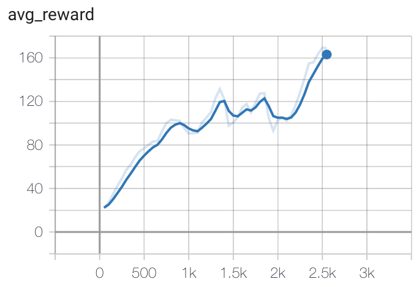

Example::

    from pl_bolts.models.rl import AdvantageActorCritic
    a2c = AdvantageActorCritic("CartPole-v0")
    trainer = Trainer()
    trainer.fit(a2c)

.. autoclass:: pl_bolts.models.rl.AdvantageActorCritic
   :noindex:

--------------

Soft Actor Critic (SAC)
^^^^^^^^^^^^^^^^^^^^^^^

Soft Actor Critic model introduced in `Soft Actor-Critic: Off-Policy Maximum Entropy Deep Reinforcement Learning with a Stochastic Actor <https://arxiv.org/abs/1801.01290>`__
Paper authors: Tuomas Haarnoja, Aurick Zhou, Pieter Abbeel, Sergey Levine

Original implementation by: `Jason Wang <https://github.com/blahBlahhhJ>`_

Soft Actor Critic (SAC) is a powerful actor critic algorithm in reinforcement learning. Unlike A2C, SAC's policy outputs a
special continuous distribution for actions, and its critic estimates the Q value instead of the state value, which
means it now takes in not only states but also actions. The new actor allows SAC to support continuous action tasks such
as controlling robots, and the new critic allows SAC to support off-policy learning which is more sample efficient.

The actor has a new objective to maximize entropy to encourage exploration while maximizing the expected rewards.
The critic uses two separate Q functions to "mitigate positive bias" during training by picking the minimum of the
two as the predicted Q value.

Since SAC is off-policy, its algorithm's training step is quite similar to DQN:

1. Initialize one policy network, two Q networks, and two corresponding target Q networks.
2. Run 1 step using action sampled from policy and store the transition into the replay buffer.

.. math::
    a \sim tanh(N(\mu_\pi(s), \sigma_\pi(s)))

3. Sample transitions (states, actions, rewards, dones, next states) from the replay buffer.

.. math::
  s, a, r, d, s' \sim B

4. Compute actor loss and update policy network.

.. math::
  J_\pi = \frac1n\sum_i(\log\pi(\pi(a | s_i) | s_i) - Q_{min}(s_i, \pi(a | s_i)))

5. Compute Q target

.. math::
  target_i = r_i + (1 - d_i) \gamma (\min_i Q_{target,i}(s'_i, \pi(a', s'_i)) - log\pi(\pi(a | s'_i) | s'_i))

5. Compute critic loss and update Q network..

.. math::
  J_{Q_i} = \frac1n \sum_i(Q_i(s_i, a_i) - target_i)^2

4. Soft update the target Q network using a weighted sum of itself and the Q network.

.. math::
  Q_{target,i} := \tau Q_{target,i} + (1-\tau) Q_i

SAC Benefits
~~~~~~~~~~~~~~~~~~~

- More sample efficient due to off-policy training

- Supports continuous action space

SAC Results
~~~~~~~~~~~~~~~~

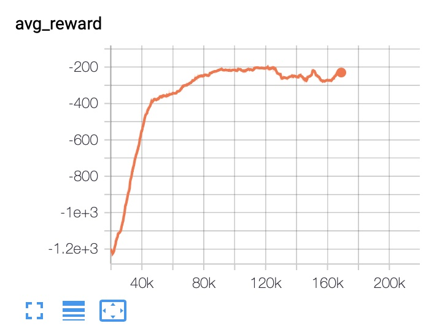

Example::
  from pl_bolts.models.rl import SAC
  sac = SAC("Pendulum-v0")
  trainer = Trainer()
  trainer.fit(sac)

.. autoclass:: pl_bolts.models.rl.SAC
    :noindex:
